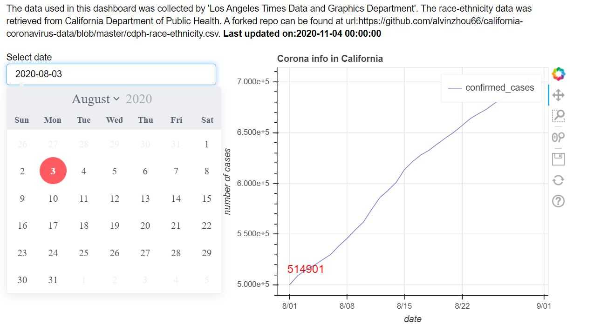
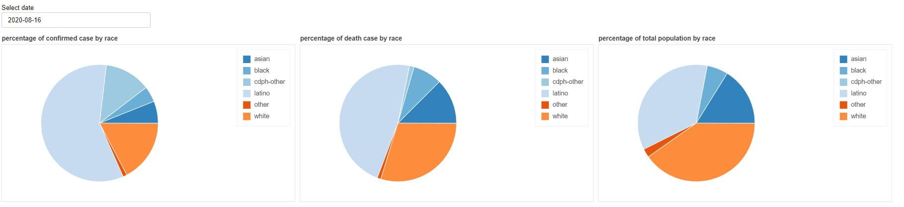
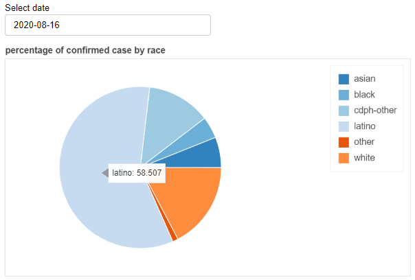
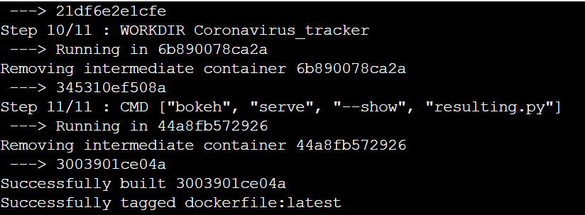
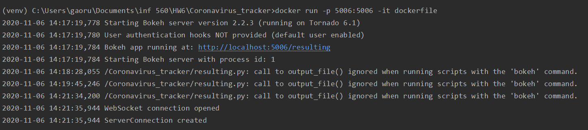

# Coronavirus_tracker
This repository contains an application that tracks the information of coronavirus in the state of california.  

# steps to run the visualization  
- locate to the working directory and git clone this repository 
- create a virtual environment by ```py -m venv env ```
- activate the virtual environment by running ```.\env\Scripts\activate```  
- Within the virtual environment, install all the dependencies by running ``` pip install -r requirementx.txt``` in the command line  
- Start the bokeh server by running ``` bokeh serve --show resulting.py ```  
- Copy ``` localhost:5006/resulting ``` to your browser to see the visualization dashboard  

The picture above shows the visualization corresponding to question 3.a. we can see the source of the data, and the exact date this was updated on the first paragraph. Changing the date in the data picker will 
result in different number in the graph, representing the number of confirmed cases 
in the state of california during that day. 

The picture above shows the visualization to question 3.b and 3.c. The first and second pie 
chart shows the percentage of cases and death by race during a selected date from the date picker. 
The third pie chart represents the percentage of each race in the general population.  

To see the exact percentage number, hover the mouse to the pie chart the percentage by race will show
up in the floating window.  
# steps to run Dockerfile 

- Copy the Dockerfile from the repository to your local directory.  
- Build the dockerfile by running ``` docker build -t dockerfile .```  
- When fished building the dockerfile, you will see the system prompt that says dockerfile:latest has been successfully tagged.  

- Run the docker image by running ```docker run -p 5006:5006 --detach --name dk dockerfile:latest``` to see the visualization panel.  

- Direct to ```localhost:5006/resulting``` to see the visualization panel  
